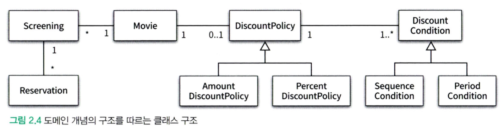
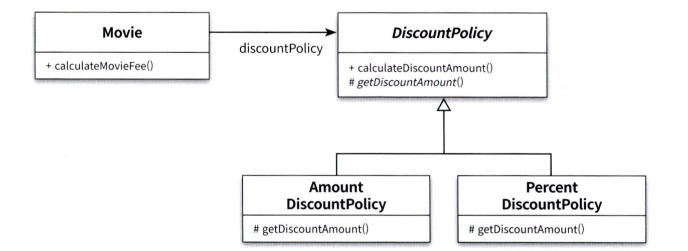
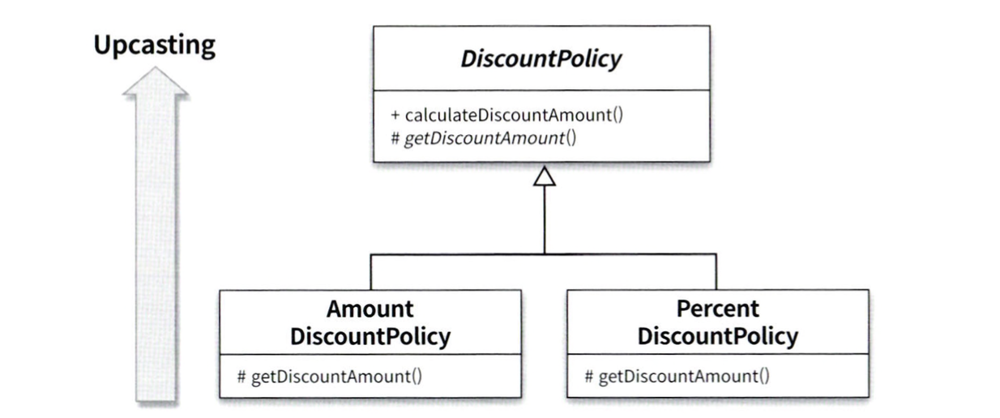

# chapter-02 객체지향 프로그래밍

### 협력, 객체, 클래스
객체지향 언어에 익숙한 사람들은 대부분 가장 먼저 어떤 클래스(class)가 필요한 지 고민할 것이다. 클래스를 결정한 후에는 어떤 속성과 메서드가 필요한지 고민한다.
그러나 이것은 객체지향의 본질과는 거리가 멀다.

그러나 클래스가 아닌 **객체에 초점을 맞출 때**에 진정한 객체지향 패러다임으로 전환이 가능하다.
1. 어떤 클래스가 필요한지를 고민하기 전에 어떤 객체들이 필요한지 고민해야한다 (설계를 단순하고 깔끔하게 만든다)
2. 객체를 독립적인 존재가 아니라 기능을 구현하기 위해 협력하는 공동체의 일원으로 봐야한다 (설계를 유연하고 확장가능하게 만든다)

### 도메인의 구조를 따르는 프로그램 구조
문제를 해결하기 위해 사용자가 프로그램을 사용하는 분야를 **도메인**이라고 부름
JAVA와 같은 객체지향 프로그래밍 언어에서 도메인의 개념을 구현하기 위해 클래스를 사용한다. 따라서 클래스는 도메인과 비슷하거나 같은 이름을 사용하는것이 좋음

> 스터디 나눔 (2025.03.25)
> 
> **전략패턴을 사용하는 이유?**
> 
> if-else로 조건을 모두 처리하기에는 코드가 너무 길어지고, 상황에 따라 유연하게 반응하기 위한 객체지향의 전략이다.
> 
> 그러나, 처음부터 디자인 패턴을 적용하는 것은 굉장히 어렵다. 주로 리팩터링 단계에서 적용
>
> **도메인을 미리 생각?**
>
> 도메인을 미리 생각하는 것은 도메인을 이해한다는 것. 정말 어렵다.
>
> 우리 서비스에서 무엇이 핵심 도메인일지 생각하고, 몇가지 도와주는 도메인을 떠올리는 방식으로 시작하면 점점 세분화가 된다.
>
> 비즈니스 요구사항이 바뀌면 내가 생각한 도메인이 갈아엎어질 가능성도 있다.

### 자율적인 객체
객체에 대한 두가지 중요한 사실은,
1. 객체는 상태(state)와 행동(behavior)을 함께 가지는 복합적인 존재이다
2. 객체는 스스로 판단하고 행동하는 자율적인 존재이다

객체지향은 객체라는 단위 안에 데이터와 기능을 한 덩어리로 묶음으로써 문제 영역의 아이디어를 적절하게 표현할 수 있게해준다. (**캡슐화**)
또한 외부에서 접근을 통제할 수 있는 **접근 제어 메커니즘**과 **접근 수정자**를 제공한다.

캡슐화와 접근 제어는 객체를 두 부분으로 나눈다.
- **퍼블릭 인터페이스** : 외부에서 접근이 가능한 부분
- **구현** : 외부에서는 접근이 불가능하고 내부에서만 접근이 가능한 부분

### 프로그래머의 자유
프로그래머의 역할을 나눌 수 있다.
- 클래스 작성자 : 새로운 데이터 타입을 프로그램에 추가
- 클라이언트 프로그래머 : 추가한 데이터 타입을 사용

접근제어 매커니즘은 클라이언트 프로그래머가 `private`속성이나 메서드에 접근하려고 시도하면 컴파일러가 오류를 보여준다.
구현을 감추면 클라이언트 프로그래머는 인터페이스만 가지고도 클래스를 사용할 수 있기때문에 머릿 속에 담아둬야 하는 지식의 양을 줄일 수 있다.

> 설계가 필요한 이유는 변경을 관리하기 위해서라는 것을 기억해야함

### 협력 (메시지와 메서드)
- 객체는 다른 객체의 인터페이스를 통해 공개된 행동을 수행하도록 **요청**
- 요청을 받은 객체는 자율적인 방법(**메서드**)에 따라 처리한 후 **응답**

여기서 **메시지**를 전송하고 수신하는 것을 통해 상호작용을 한다. 

> 메시지와 메서드의 구분에서 다형성의 개념이 시작되므로 중요함

### 컴파일 시간 의존성과 실행 시간 의존성
**의존성** : 어떤 클래스가 다른 클래스에 접근할 수 있는 경로를 가지거나 해당 클래스의 객체의 메서드를 호출할 경우 발생

코드의 의존성과 실행 시점의 의존성은 서로 다를 수 있다.
위 그림에서 `Movie`클래스는 **코드 상**에서 `DiscountPolicy` 추상 클래스를 의존하고 있으나 (*Compile-time dependency*), 실제로 매개변수로는 `AmountDiscountPolicy` 또는 `PercentDiscountPolicy`의 인스턴스를 제공받기 때문임(*Runtime Dependency*).

이 의존성이 존재하는 시점이 다를 수록, 코드만 보고 이해하기 어려워진다.
설계가 유연해질수록 코드를 이해하고 디버깅하기는 점점 더 어려워진다. 반면 유연성을 억제하면 재사용성과 확장 가능성이 낮아진다.

> 의존성의 양면성은 설계가 트레이드오프의 산물이라는 사실을 잘 보여준다.

### 상속과 인터페이스
상속이 가치 있는 이유는 부모 클래스가 제공하는 모든 인터페이스를 자식 클래스가 물려받을 수 있기 때문이다. **인터페이스**는 객체가 이해할 수 있는 메시지의 목록을 정의한다.

따라서 자식 클래스가 부모 클래스를 대신할 수 있으며 이를 업캐스팅(upcasting)이라고 부른다.

클래스 다이어그램을 그릴때 자식 클래스를 부모클래스의 아래로 그리기 때문에 업캐스팅이라고 한다.
### 다형성
다형성은 객체지향 프로그램의 컴파일 시간 의존성과 실행 시간 의존성이 다를 수 있다는 사실을 기반으로 한다. 이를 통해 필요에 따라 서로 다른 메서드를 실행 시킬 수 있게한다.

다형성을 구현하는 방법은 다양하지만, 메시지의 응답하기 위해 실행될 **메서드**를 **실행 시점**에 바인딩한다.
- 지연 바인딩 (lazy binding), 동적 바인딩 (dynamic binding)

이에 반대로 전통적인 함수 호출처럼 **컴파일 시점**에 실행될 함수나 프로시저를 결정하는 경우는 다음으로 부른다.
- 초기 바인딩 (early binding), 정적 바인딩 (static binding)

### 상속과 합성
- 상속: **is-a** 관계로서, 부모클래스를 상속받은 자식 클래스를 구현하는 방법
- 합성: **has-a** 관계로서, 클래스가 다른 클래스의 객체를 멤버로 가지고 있는 방법

사람들은 합성을 상속보다 선호하는데 그 이유는 다음과 같다:
- 상속은 캡슐화를 위반한다.
	- 부모 클래스의 구현이 자식 클래스에게 노출된다. 
- 상속은 설계를 유연하게 할 수 없다.
	- 클래스의 관계가 컴파일 시점에 결정되어 변경이 불가능하다.